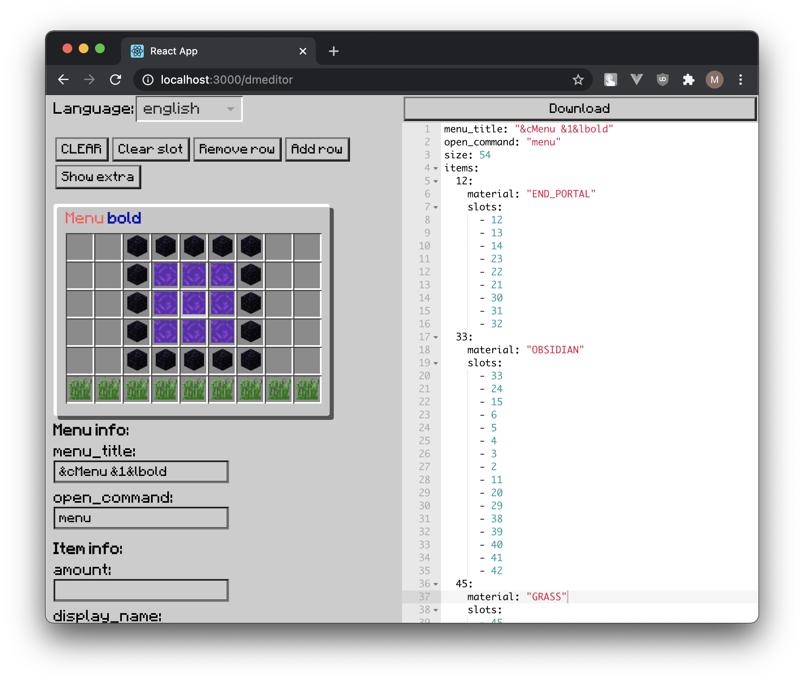

# DeluxeMenus Editor

Visual editor for [DeluxeMenus](https://wiki.helpch.at/clips-plugins/deluxemenus)

#### Demo: https://tabmk.github.io/dmeditor/

<p align="center">
  
  
</p>

---

# ⚠️ WIP | Early version

Install dependencies
```
yarn install
   or
npm i
```

Run:
```
yarn start
   or
npm start
```
---
### Features
- __auto-save__ you can reload page any time w/o losing data, all saved in localStorage
- __visual edit__ you can even search items by name (items provided by [minecraft-items](https://github.com/pandapaul/minecraft-items). __TODO__: add support of [minecraft-blocks-render](https://github.com/TABmk/minecraft-blocks-render) data)
- __All actual__ fields of config
- __YML__ export from right-side window (TODO add file export)
- __Pre-configured__ items select. It will change "slot" field to "slots" for using same info for those items
- __Preview__ even with minecraft color styled title

---

##### A lot of work to do. Just wanted to share it
